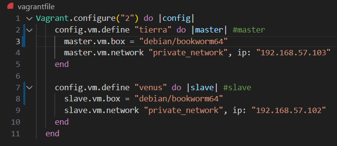

# Práctica DNS Maestro-Esclavo

Esta práctica configura un servidor DNS maestro en `tierra.sistema.test` y un servidor esclavo en `venus.sistema.test`. A continuación se detallan los pasos de configuración y las comprobaciones realizadas.

# Practica_Sistema.test
